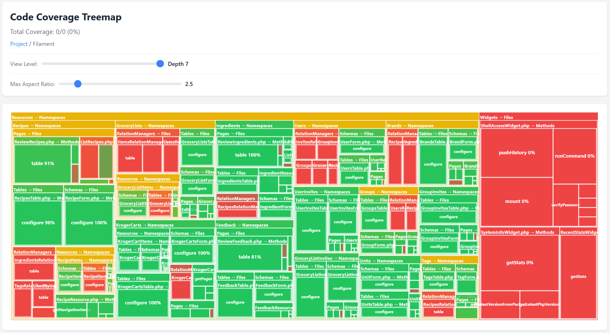

# Coverage Treemap PHPUnit Extension

A PHPUnit extension that generates an interactive squarified treemap visualization of code coverage.



## Installation

```bash
composer require --dev michael4d45/coverage-treemap
```

## Configuration

Add the extension to your `phpunit.xml`:

```xml
<extensions>
    <bootstrap class="CoverageTreemap\CoverageTreemap\Extension">
        <parameter name="outputDirectory" value="reports/coverage-treemap" />
        <parameter name="defaultNamespace" value="App" />
    </bootstrap>
</extensions>
```

### Configuration Parameters

- **`outputDirectory`** (optional): Directory where the treemap HTML report will be generated. Defaults to `reports/coverage-treemap`.
- **`defaultNamespace`** (optional): Default namespace prefix to use when organizing the treemap. Defaults to `App`.

The extension automatically reads source directories from your `<source><include>` configuration and excluded directories from `<source><exclude>`.

## Usage

Run PHPUnit with coverage:

```bash
phpunit --coverage
# or
vendor/bin/phpunit --coverage
```

After tests complete, open `reports/coverage-treemap/index.html` in your browser.

## Requirements

- PHP 8.3+
- PHPUnit 11+
- Code coverage driver (PCOV, Xdebug, etc.)

## License

This project is open-sourced software licensed under the [MIT License](LICENSE).

